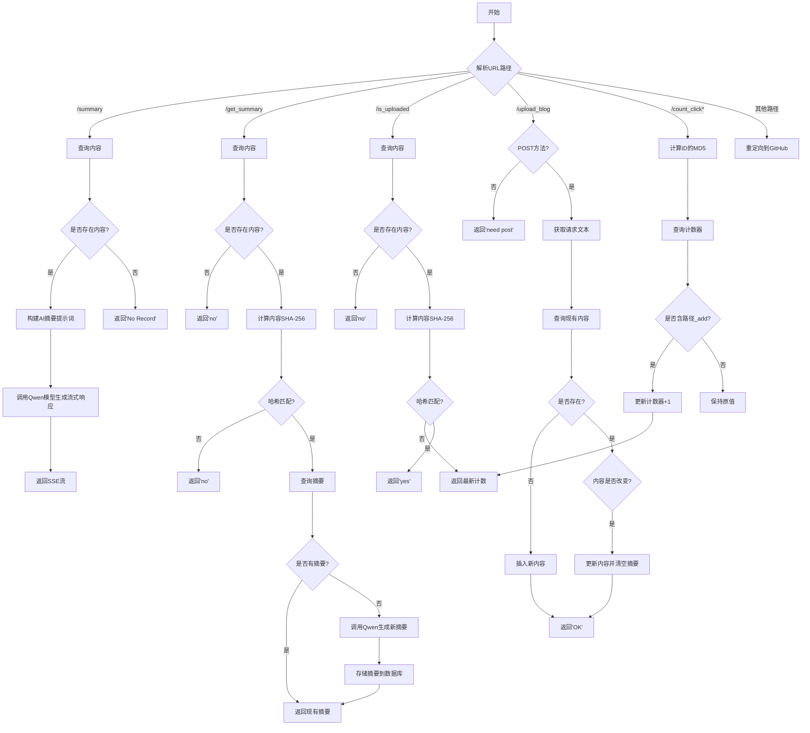
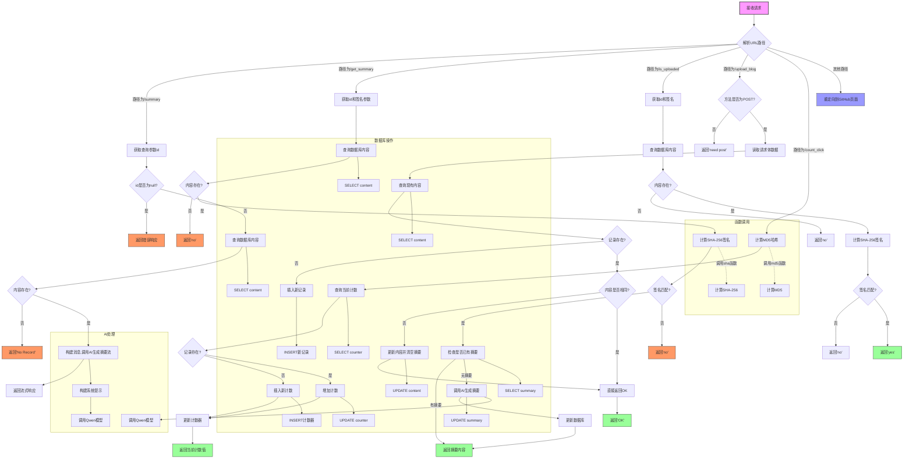

  使用最强的Macintosh是一种什么样的感受？<!--more-->    

# 起因
  在两个月前苹果公司出了一款可以选配超大统一内存（512GiB）的Mac Studio，那时候我还[想着如果市场反应好就整台玩玩](/2025/03/08/llm2.html#%E5%85%B3%E4%BA%8E%E6%96%B0%E5%87%BA%E7%9A%84mac-studio%E7%9A%84%E7%9C%8B%E6%B3%95)，现在从网上的各种反应来看这确实是一个很不错的产品，所以这次我就整来啦！所以这次就来谈谈初上手的体验吧～   

# 远程体验
  虽然Mac Studio理论上拿来剪电影之类的应该是更好的选择，但是显然我不会剪电影🤣，而且也没有合适的屏幕给它用，所以拿到手之后我需要让它可以远程使用。   
  macOS配置远程还是挺简单的，只需要在设置 -> 通用 -> 共享中打开远程管理就可以了（似乎现在Ubuntu也可以像这样轻松地配置远程桌面），配置好之后需要启用“任何人都可以请求取得控制屏幕的权限”选项，不然可能会连不上……   
  另外如果需要配置SSH也只需要打开远程登录即可，最好把“允许远程用户对磁盘进行完全访问”也打开，免得使用时还需要额外的操作。   
  其实开启远程没什么特别的，不过我发现在远程Mac Studio时和我远程Intel芯片的[Mac mini 2018](/2024/08/17/mac-mini.html)以及[黑苹果](/2024/06/16/hackintosh.html)有一个不一样的地方，那就是屏幕共享类型可以选择“[高性能](https://support.apple.com/zh-cn/guide/remote-desktop/apdf8e09f5a9/mac)”，在这个模式下远程的屏幕就可以变成一块虚拟屏幕，不受Mac连接的屏幕分辨率所影响，可以配置动态分辨率。即使连接的屏幕不支持HiDPI，只要远程的客户端支持那就可以支持，这一点和Windows的远程桌面有点像，但是体验好太多了，使用起来和本地几乎没有差别，当然代价就是对网络要求特别高，基本上如果不是局域网内远程，就不能使用这个模式。   
  在我配置好远程后我就可以拔掉屏幕，然后把Mac Studio放在阴暗的角落里为我服务了😆。   

# 关于LLM的体验
## 配置环境
  买这个设备的当然也不为别的，主要就是为了能在本地跑完整参数的DeepSeek-R1，或者类似的MoE模型。至于KTransformers方案考虑到按照正价买要更贵（当然有便宜的购买方案，但是太不可靠了），而且这个框架也不够成熟，所以就算了。   
  在Mac上运行LLM有很多框架，最开始我选择的是[Xinference](https://github.com/xorbitsai/inference)，因为看它的[文档](https://inference.readthedocs.io/zh-cn/latest/user_guide/backends.html#mlx)中特地提到了苹果的[MLX](https://github.com/ml-explore/mlx)框架，而且可以使用命令启动，方便维护，另外看它支持的模型种类也比较多，所以就先考虑了它。   
  按照官方文档安装后就可以配置模型了，虽然它可以直接一键下载并运行模型，但是我已经提前下好了模型，另外……如果光运行DeepSeek-R1感觉也没啥意思，不如试试Perplexity AI的[某个Finetune模型](https://huggingface.co/mlx-community/perplexity-ai-r1-1776-4bit)😆？所以我需要手动注册模型。配置好之后在MaxKB中配置好地址就可以使用了。   
  刚开始测试的时候倒是没啥问题，吐字的速度确实是挺快，但是用了几下就发现有不少问题，比如每次调用LLM的时候会发现内存压力会上升，APP内存会变成联动内存，在这个期间GPU并不会工作，需要等几秒钟，在生成结束的时候内存压力又会下降，联动内存会变回APP内存，每次生成都是这样。另外如果上文很长就要等几分钟，而且如果上文特别长的情况爆内存程序会直接卡死，还有并发也会导致程序卡死……总的来说这个框架根本不适合生产环境使用，而且文档也写的极其糟糕，看来是我看走眼了，不应该选择Xinference。   
  在抛弃Xinference之后我想了想还是随大流吧，选择了[LM Studio](https://github.com/lmstudio-ai)，虽然它需要远程桌面操作，但是配置好之后应该也没有什么太多需要修改的地方，主要是社区相对要活跃得多，出了问题也好解决。   
  在我安装好LM Studio后发现这个支持的功能要多不少啊，还支持KV Cache量化，有了这个就可以支持更长的上下文了，另外它还支持超出上下文之后选择截断还是滚动，看起来使用非常的友好。   
  当我对LM Studio充满期待的时候问题就来了，我随便问了些问题，然后它回答的时候不知道什么情况会随机莫名其妙的冒出“<｜begin▁of▁sentence｜>”，出现这个之后后面的内容就会胡乱生成内容，怎么调都没法解决……后来看了一下DeepSeek的[Issue里](https://github.com/deepseek-ai/DeepSeek-R1/issues/352)提到了似乎需要在模板中添加“\<think\>”标签才可以……但是这样的结果就是输出开头没有“\<think\>”了，MaxKB解析会出问题……这个问题的话回头看怎么解决吧，至少在模板中加上这个能正常使用了。LM Studio不会每次请求都重新加载一遍模型，输出第一个字的速度比Xinference快了很多，后面生成的速度也很快，输出的速度能接近20T/s，相比来说还是更有用一些。   
## 模型对比
  在我测试完DeepSeek-R1的某个微调模型后，最近阿里又出了一系列新模型：[Qwen3](https://huggingface.co/collections/Qwen/qwen3-67dd247413f0e2e4f653967f)，支持根据问题进行推理，据说它的235B参数的MoE模型比DeepSeek-R1还厉害，如果是真的，那就不需要用DeepSeek-R1了，虽然Mac Studio可以运行DeepSeek，但是512GiB内存也只能运行4位量化的DeepSeek-R1，而235B的Qwen3则可以用8位量化，还能空出不少内存用于上下文，想来应该效果会比DeepSeek好很多吧？于是我就下载试了试，然而刚下载好之后居然不能运行😅，首先是这个模型太新了，运行前需要把运行库的版本更新到最新，另外默认的模板有问题，解析会报错，需要根据[这个Issue](https://github.com/lmstudio-ai/lmstudio-bug-tracker/issues/630)修改一下才能正常运行😅。在一切准备好之后，就可以进行测试了。   
  首先我试了试一些比较简单的问题，Qwen3回答的都还不错，例如24点、内容填空之类的，效果比QwQ-32B好了不少。测试的时候输出的速度和671B 4位量化的DeepSeek-R1基本一致。随后我让它用Mermaid绘制我以前写的[AI摘要脚本](/2024/07/03/ai-summary.html)的流程图，Qwen3绘制的结果是：   

  DeepSeek-R1的某个微调模型的结果是：

  这下就高下立判了🤣，同样的问题Qwen3只绘制了基础流程图，而DeepSeek-R1不仅包含子流程图，还通过颜色区分了响应类型，这么看来Qwen3还是不太行啊～当然我的测试非常的片面，仅仅根据这几次测试分析的结果。至于Qwen3到底有没有使用价值，回头再让其他人测测看效果如何吧。   

# UTM虚拟机的测试
  在上次[在UTM上用苹果虚拟化框架安装Windows](/2025/03/25/utm.html)的测试中我用的是Intel芯片的Mac，那时候已经说了打算等Mac Studio到了之后尝试一下用VZ框架安装Windows。那么经过我的测试结果如何呢？想不到居然失败了😭，相同的操作流程在重装脚本执行完后，再重启就没有任何反应了。在活动监视器中虽然可以看到虚拟机的CPU占用是100%，但是内存只占用了100多MiB，而且CPU占用没有任何跳变，显然系统没有正常启动。随后我又尝试在QEMU中安装好Windows然后把VZ虚拟机的硬盘替换掉，结果依旧一样，内存还是只占了100多MiB……看来ARM处理器和x86处理器还是有很大区别啊……   
  不过这个虚拟机到底有什么区别？为什么会无法启动呢？想到我在Intel芯片的Mac中测试用VZ框架是可以看到CPU型号的，再看看Mac Studio中的Linux虚拟机……似乎没有任何与CPU型号有关的信息，用QEMU至少也能看到类似“virt”之类的CPU型号，用VZ框架就什么信息都没有了……看来Apple芯片和正常的ARM处理器还是有不少区别啊……   
  不过除了这个以外还有什么有意思的东西可以测试吗？这时候我就想到了[Asahi Linux](https://github.com/AsahiLinux)，Apple芯片下的UTM有一个多出来的选项就是可以安装macOS虚拟机，那我能不能在macOS虚拟机中安装Asahi Linux呢？根据我的实际测试，结果也是不行的……因为Asahi Linux不支持M3 Ultra芯片😞，至于M2芯片能不能在虚拟机中运行Asahi Linux……虽然我的MacBook是M2芯片，但是不太想在我常用的机器上搞测试，所以也不知道实际上可不可以。另外Asahi Linux这个项目也基本上停了，估计以后新出的芯片也不会有机会安装Linux了，就像在macOS上运行Windows程序的[Whisky](https://github.com/Whisky-App/Whisky)项目也停了……真是太遗憾了😢。   

# 感想
  从这次体验来看，512GiB内存的Mac Studio M3 Ultra确实很厉害，本地跑LLM速度非常快，20T/s的速度已经很厉害了，而且风扇声音很小，在GPU满载的时候也完全听不到风扇的声音。当然这个前提是跑MoE模型，虽然我没测Dense模型，但想来根据M3 Ultra的算力，跑70B参数的模型肯定是达不到20T/s的，至于更大的模型估计速度就慢的不能看了……不过不影响，这已经够我用了。   
  至于除LLM以外的用途……我似乎没有什么能用到这么强性能以及这么大内存的地方了……其实还是挺浪费的，但是也没办法，毕竟我又不会剪电影啊🤣。   

