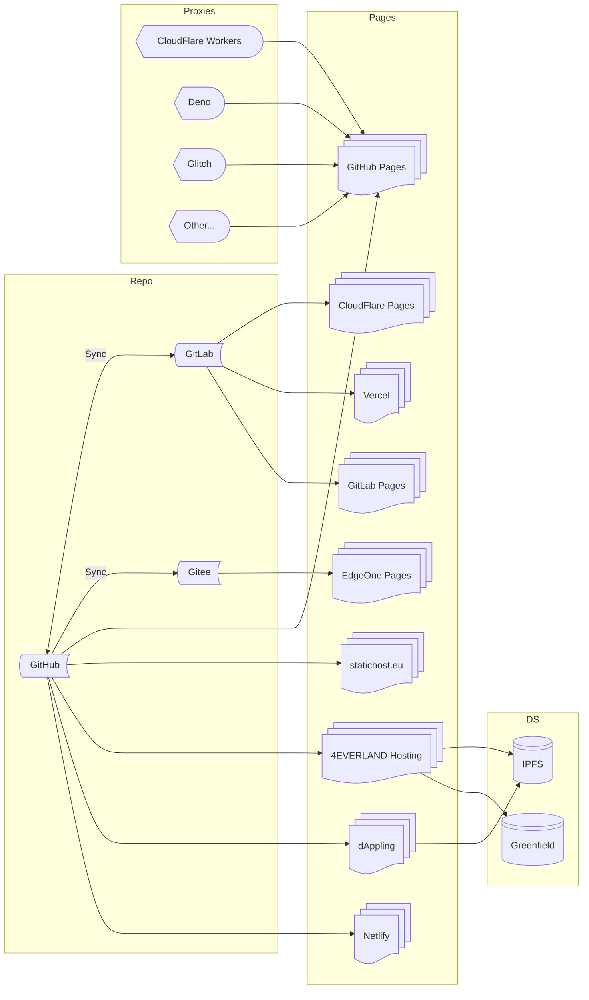

  源站：<https://mabbs.github.io>    

# 代理列表
考虑到中国对于Github Pages在很多地区都有一定程度的解析异常，所以我为我的博客做了很多反向代理。以下代理站均为官方授权：   
（根据可能的可用性排序）   
- <{{ item.url }}>    


# 镜像列表
由于[Github已经不再可信](/2022/01/04/banned.html)，所以现在提供以下镜像站：   
- <{{ item.url }}>    


# 网站结构

# 其他平台博客（备用）
- <{{ item.url }}>    

